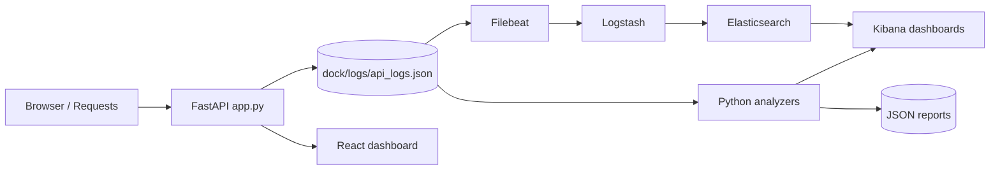
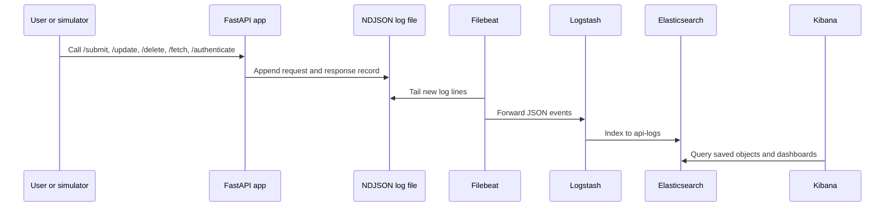
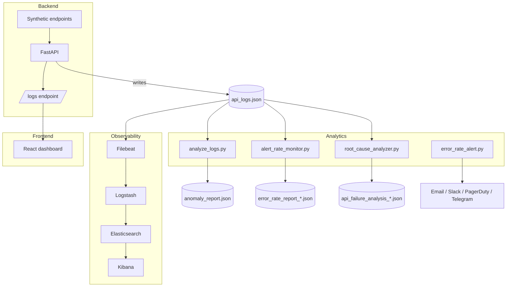
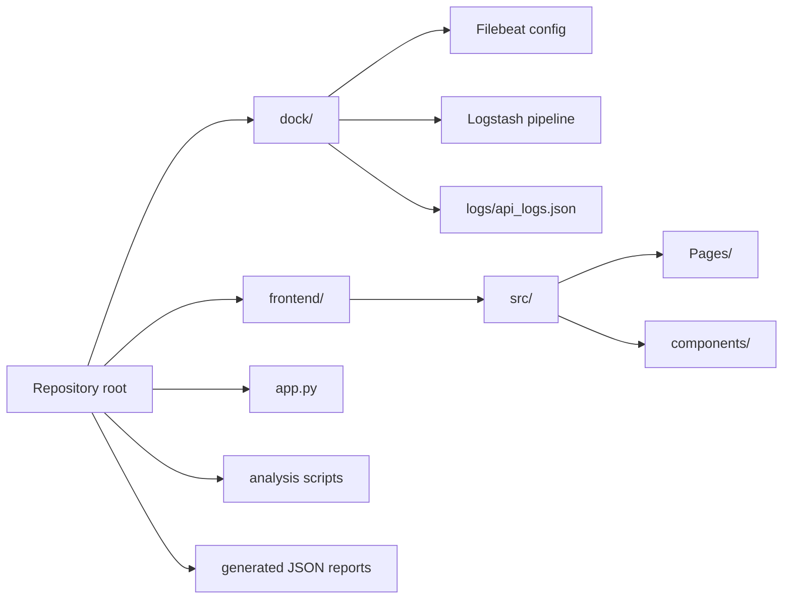

# API Log Monitoring

<p align="center">
   <strong>FastAPI log generator, offline anomaly analysis, and ELK/Kibana observability demo.</strong>
</p>

<p align="center">
   <a href="#system-architecture">Architecture</a> ·
   <a href="#installation">Installation</a> ·
   <a href="#running-the-project">Run</a> ·
   <a href="#usage">Usage</a> ·
   <a href="#future-improvements">Roadmap</a>
</p>

## Project Banner

API Log Monitoring is a small observability-focused project that generates synthetic API traffic, writes NDJSON logs, analyzes error and latency patterns, and visualizes the results in a React dashboard and Kibana.

## System Architecture









## Project Workflow

1. Start the FastAPI server in [app.py](app.py) to expose synthetic API routes and the `/logs` endpoint.
2. Generate traffic manually or with [simulate_requests.py](simulate_requests.py).
3. Each request is written as a single NDJSON record in [dock/logs/api_logs.json](dock/logs/api_logs.json).
4. Filebeat tails that file and forwards events to Logstash.
5. Logstash indexes the events into Elasticsearch.
6. Kibana uses saved objects from [kibana_dashboard.ndjson](kibana_dashboard.ndjson) to visualize the stream.
7. Offline analyzers produce JSON reports for anomaly detection, error rates, and root-cause analysis.
8. The React dashboard polls `/logs` and renders the same log data in a browser UI.

## Folder Structure

```text
.
├── app.py
├── analyze_logs.py
├── alert_rate_monitor.py
├── error_rate_alert.py
├── root_cause_analyzer.py
├── root_cause_to_kibana.py
├── kibana_integration.py
├── anomaly_report_to_kibana.py
├── simulate_requests.py
├── alert_config.json
├── clean_requirements.txt
├── dock/
│   ├── docker-compose.yml
│   ├── filebeat.yml
│   ├── logs/
│   │   └── api_logs.json
│   └── logstash/
│       └── pipeline/
│           └── logstash.conf
├── frontend/
│   ├── package.json
│   └── src/
├── services/
│   └── ml_inference/
│       ├── app.py
│       ├── README.md
│       └── requirements.txt
└── *.json reports
```

Major folders:

- [dock/](dock/) contains the local ELK stack and the sample log sink.
- [frontend/](frontend/) contains the React dashboard built with Vite.
- [services/ml_inference/](services/ml_inference/) contains the optional ML scoring service extracted from the cloned repository.
- The repository root contains the FastAPI app, offline analysis scripts, and generated reports.

## Installation

### Python backend

```bash
python3 -m venv .venv
source .venv/bin/activate
pip install -r clean_requirements.txt
```

### Frontend

```bash
cd frontend
npm install
```

### Docker observability stack

Install Docker Desktop and ensure the following ports are available: 8000, 5044, 5601, and 9200.

### Optional ML service

```bash
cd services/ml_inference
python3 -m venv .venv
source .venv/bin/activate
pip install -r requirements.txt
```

## Configuration

### [alert_config.json](alert_config.json)

Controls notification channels for the alerting script. The checked-in file should be treated as a sample; replace SMTP passwords, webhook URLs, and chat IDs with environment-backed secrets before real use.

### [dock/filebeat.yml](dock/filebeat.yml)

Configures Filebeat to tail [dock/logs/api_logs.json](dock/logs/api_logs.json), parse each line as JSON, and forward events to Logstash.

### [dock/logstash/pipeline/logstash.conf](dock/logstash/pipeline/logstash.conf)

Defines the Beats input and Elasticsearch output for the ingest pipeline. The current output index is `api-logs`.

### [dock/docker-compose.yml](dock/docker-compose.yml)

Defines Elasticsearch, Kibana, Logstash, and Filebeat services plus the environment variables used to bootstrap the local stack.

### Environment variables

- `ENVIRONMENT` is read by [app.py](app.py) and stored in each log record.
- `ES_LOCAL_PASSWORD` is used by the Kibana integration scripts and Docker stack.
- `KIBANA_LOCAL_PASSWORD` and `KIBANA_ENCRYPTION_KEY` are required by the Docker stack.
- `ENABLE_ML_SERVICE` enables the optional ML callback in [app.py](app.py).
- `ML_SERVICE_URL` points to the optional Flask service at `services/ml_inference/app.py`.
- `ML_LOG_FILE`, `ML_MODEL_DIR`, `ES_HOST`, `ES_USERNAME`, `ES_PASSWORD`, and `ML_SERVICE_PORT` configure the extracted ML service.

## Running the Project

### Development

```bash
source .venv/bin/activate
uvicorn app:app --reload --host 127.0.0.1 --port 8000
```

In a second terminal:

```bash
cd frontend
npm run dev
```

### Production-style execution

```bash
source .venv/bin/activate
uvicorn app:app --host 0.0.0.0 --port 8000
```

### Docker

```bash
cd dock
docker compose up -d
```

### Testing and analysis

```bash
source .venv/bin/activate
python analyze_logs.py
python alert_rate_monitor.py
python error_rate_alert.py
python root_cause_to_kibana.py --analyze-only
python anomaly_report_to_kibana.py
```

### ML service

```bash
cd services/ml_inference
source .venv/bin/activate
python app.py
```

Enable it from the root app with `ENABLE_ML_SERVICE=true` once the service is running.

### Examples

Generate traffic:

```bash
source .venv/bin/activate
python simulate_requests.py
```

Fetch log data:

```bash
curl http://127.0.0.1:8000/logs
```

## Usage

Start the backend, generate a small amount of traffic, and open the React dashboard at the Vite dev server. The page will show total requests, success rate, average response time, error count, anomaly cards, a recent logs table, and multiple charts derived from live log records.

The synthetic endpoints are intended for observability demos only:

- `/submit`
- `/update`
- `/delete`
- `/fetch`
- `/authenticate`
- `/logs`

Example request:

```bash
curl -X POST http://127.0.0.1:8000/submit \
   -H 'Content-Type: application/json' \
   -d '{"name":"Alice","value":42}'
```

Example response:

```json
{
  "status": "success",
  "data": {
    "name": "Alice",
    "value": 42
  }
}
```

## API Documentation

### `GET /logs`

Returns the parsed NDJSON log stream as JSON.

Example response fields:

- `timestamp`
- `method`
- `endpoint`
- `url`
- `headers`
- `request_body`
- `response_body`
- `status_code`
- `environment`
- `response_time_ms`

### Synthetic routes

Each of the synthetic routes accepts GET, POST, PUT, and DELETE. The handler randomly returns 2xx, 4xx, or 5xx responses, then logs the request and response metadata.

## Model / Algorithm Explanation

This repository does not train a large ML model end to end. The analysis layer is a mix of pandas-based aggregation, rule-based anomaly detection, and classical clustering.

- [analyze_logs.py](analyze_logs.py) builds a lightweight anomaly report using response-time, error-pattern, and traffic heuristics.
- [alert_rate_monitor.py](alert_rate_monitor.py) computes error rates by endpoint, method, and environment.
- [root_cause_analyzer.py](root_cause_analyzer.py) applies pattern matching, DBSCAN clustering, and time-based heuristics to infer likely failure causes.
- [kibana_integration.py](kibana_integration.py) converts those findings into Elasticsearch documents and Kibana-ready saved objects.
- [services/ml_inference/app.py](services/ml_inference/app.py) is the optional ML scoring service extracted from the cloned repo and normalized for environment-based configuration.

## Technology Stack

| Area              | Technologies                                      |
| ----------------- | ------------------------------------------------- |
| Backend           | FastAPI, Uvicorn, Python, dotenv                  |
| Data analysis     | pandas, numpy, scikit-learn, requests             |
| Frontend          | React, Vite, Recharts, Lucide React, Tailwind CSS |
| Observability     | Elasticsearch, Kibana, Logstash, Filebeat         |
| Runtime packaging | Docker, Docker Compose                            |

## Screenshots

Capture these once the README is finalized:

- React dashboard landing view with summary cards and the traffic chart.
- Recent API logs table with several rows of generated traffic.
- Anomaly detection panel showing at least one high-severity item.
- Kibana dashboard panels for error distribution, response times, and insights.
- Docker Compose terminal or container list showing the ELK services running.

## Future Improvements

- Replace hardcoded local paths with a shared configuration layer.
- Move generated JSON reports out of the repository root.
- Add tests for the FastAPI routes and analysis scripts.
- Unify the naming drift between the monitor and alert scripts.
- Externalize secrets in `alert_config.json` into environment variables.
- Align the Logstash index name with the Kibana dashboard export or add an alias step.

## Historical Context

This project originated as a hackathon prototype. The codebase has been modernized in documentation terms so the repository now reflects the real runtime stack, current folder structure, and the demo-oriented observability workflow.
